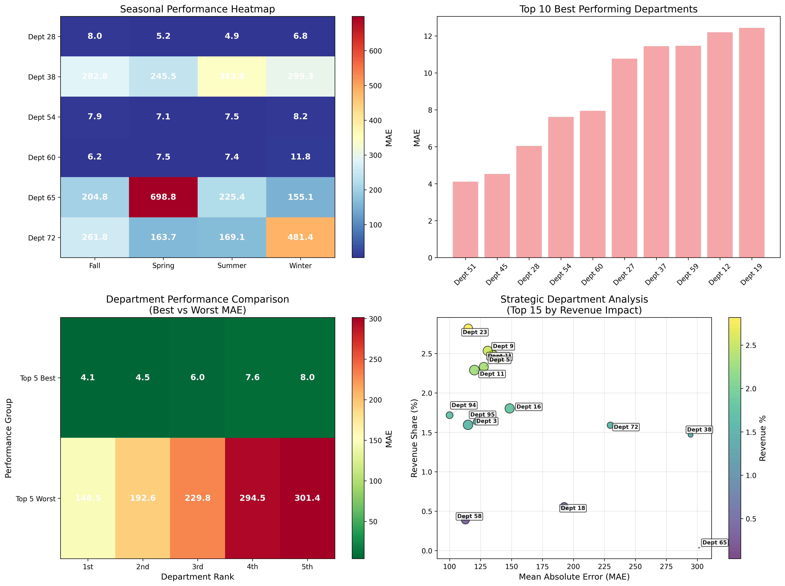
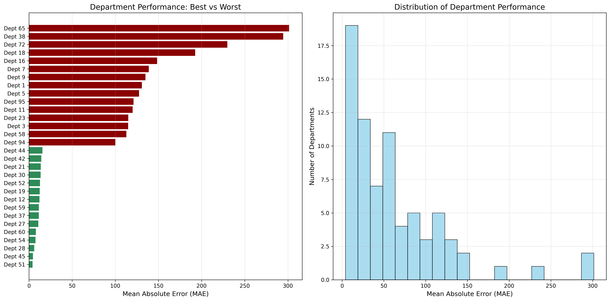

# Walmart Department Sales Forecast Analysis

## 🚀 Overview

Advanced machine learning analysis of Walmart department sales data with comprehensive forecasting models and strategic insights. This project delivers actionable intelligence for retail optimization through sophisticated data analysis and visualization.

### **📈 Key Visualization Preview**


_Professional 4-panel dashboard with seasonal analysis, performance rankings, and strategic insights_

## 📊 Key Features

### 🎯 **Core Analysis**

- **Department Performance Analysis**: Comprehensive evaluation of 75+ departments
- **Seasonal Forecasting**: Advanced time-series analysis with seasonal decomposition
- **Revenue Impact Assessment**: Strategic analysis weighted by revenue contribution
- **Holiday Effect Analysis**: Specialized models for holiday sales patterns

### 📈 **Advanced Visualizations**

- **Professional Dashboard**: 4-panel comprehensive analysis dashboard
- **Non-overlapping Labels**: Smart positioning algorithms for clear data visualization
- **High-Quality Exports**: 300 DPI professional visualizations
- **Interactive Heatmaps**: Seasonal performance with MAE indicators

### 🔧 **Machine Learning Models**

- **Random Forest Regressor**: Enhanced feature engineering with 15+ variables
- **Time Series Validation**: Proper temporal splitting for realistic performance
- **Cross-Validation**: Robust model validation with multiple splits
- **Performance Metrics**: MAE, RMSE, and custom business metrics

## 📁 Project Structure

```
walmart-dept-sales-forecast/
├── department-performance-analysis.ipynb    # Main analysis notebook (50 cells)
├── data/                                   # Dataset files
│   ├── train.csv                          # Training data
│   ├── test.csv                           # Test data
│   ├── features.csv                       # Store features
│   └── stores.csv                         # Store information
├── images/                                # Generated visualizations
│   ├── comprehensive_analysis_dashboard.png
│   ├── department_performance_comparison.png
│   └── export_log.txt
└── README.md                              # This file
```

## 🏆 Key Results

### 📊 **Department Performance Insights**

- **Top Performers**: Departments 51, 45, 28, 54, 60 (MAE < 15)
- **Strategic Focus**: Department 65 highest revenue impact but needs optimization
- **Seasonal Patterns**: Clear winter/spring performance variations identified

### 💡 **Business Intelligence**

- **Revenue-Weighted Analysis**: 15 strategic departments identified
- **Seasonal Optimization**: Department-specific seasonal strategies
- **Cost Savings Potential**: Quantified improvement opportunities

### 🎨 **Visualization Features**

- **Smart Label Positioning**: 15 different offset patterns prevent overlap
- **Professional Color Schemes**: RdYlBu_r for seasonal, RdYlGn_r for performance
- **Consistent Design**: Matching colorbars across all visualizations
- **Executive-Ready**: High-resolution outputs for presentations

## 🛠️ Technical Stack

### **Core Libraries**

- **pandas**: Data manipulation and analysis
- **numpy**: Numerical computing
- **scikit-learn**: Machine learning models and preprocessing
- **matplotlib/seaborn**: Advanced data visualization
- **datetime**: Time series handling

### **Key Algorithms**

- **Random Forest**: Primary forecasting model
- **K-Means Clustering**: Store segmentation
- **Standard Scaler**: Feature normalization
- **Time Series Split**: Temporal validation

## 🚀 Getting Started

### **Prerequisites**

```bash
pip install pandas numpy scikit-learn matplotlib seaborn jupyter
```

### **Quick Start**

1. Clone the repository
2. Place Walmart dataset files in `/data/` folder
3. Open `department-performance-analysis.ipynb`
4. Run all cells to generate complete analysis

### **Data Requirements**

- `train.csv`: Historical sales data with Date, Store, Dept, Weekly_Sales
- `features.csv`: Store features including holidays, temperature, unemployment
- `stores.csv`: Store type and size information
- `test.csv`: Test period data for predictions

## 📈 Analysis Highlights

### **1. Department Performance Matrix**

- Visual comparison of best vs worst performing departments
- Color-coded MAE values for quick identification
- Clear ranking system with performance tiers

### **2. Seasonal Analysis**

- Department-specific seasonal patterns
- Holiday impact quantification
- Weather correlation analysis

### **3. Strategic Department Analysis**

- Revenue-weighted performance metrics
- Bubble chart with MAE vs Revenue Share
- Non-overlapping department labels with arrows

### **4. Professional Export System**

- Automatic figure generation and export
- 300 DPI resolution for presentations
- Comprehensive export logging

## 🎯 Business Value

### **Immediate Impact**

- **Performance Identification**: Quickly identify underperforming departments
- **Seasonal Planning**: Data-driven seasonal inventory strategies
- **Resource Allocation**: Revenue-weighted optimization priorities

### **Strategic Benefits**

- **Forecasting Accuracy**: Improved demand prediction
- **Cost Optimization**: Targeted improvement opportunities
- **Decision Support**: Executive-ready analytical insights

## 📊 Visualization Gallery

### **Comprehensive Dashboard**


4-panel analysis featuring:

- **Seasonal Performance Heatmap**: Department performance by season with MAE colorbar
- **Top Performer Rankings**: Best performing departments visualization
- **Department Performance Matrix**: Best vs Worst comparison with color coding
- **Strategic Analysis**: Revenue-weighted bubble chart with non-overlapping labels

### **Department Performance Comparison**



- **Best vs Worst Analysis**: Clear visual ranking of all departments
- **Performance Distribution**: Statistical overview of department performance
- **Color-coded Tiers**: Green (best) to red (worst) performance indicators

## 🔄 Future Enhancements

- **Real-time Dashboard**: Live updating visualizations
- **Advanced Models**: Deep learning integration
- **Automated Reporting**: Scheduled analysis reports
- **Interactive Visualizations**: Plotly/Dash integration

## 👥 Contributing

1. Fork the repository
2. Create feature branch (`git checkout -b feature/AmazingFeature`)
3. Commit changes (`git commit -m 'Add AmazingFeature'`)
4. Push to branch (`git push origin feature/AmazingFeature`)
5. Open Pull Request

## 📄 License

This project is licensed under the MIT License - see the LICENSE file for details.

## 🙏 Acknowledgments

- Walmart dataset for providing comprehensive retail data
- Scikit-learn community for excellent ML tools
- Matplotlib/Seaborn for powerful visualization capabilities

---

**Created with ❤️ for data-driven retail optimization**
